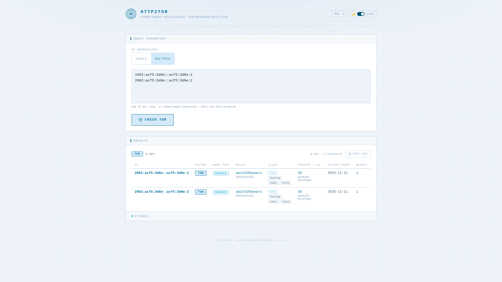

# http2tor

> **Tor-over-HTTP** — A lightweight HTTP gateway that exposes Tor network detection as a JSON REST API.

Built in Go, it accepts a `POST` request with one or more IP addresses and returns structured Tor relay data sourced from a **self-built mmdb database** — constructed from a gzipped CSV served by the **letstool CDN** (`https://cdn.letstool.net/tor/csv`), with zero runtime dependencies.

---

## Screenshot



> The embedded web UI (served at `/`) provides an interactive form to check IP addresses against the Tor network. It supports **dark and light themes** and is fully translated into **15 languages**.

---

## Disclaimer

This project is released **as-is**, for demonstration or reference purposes.
It is **not maintained**: no bug fixes, dependency updates, or new features are planned. Issues and pull requests will not be addressed.

---

## License

This project is licensed under the **MIT License** — see the [`LICENSE`](LICENSE) file for details.

```
MIT License — Copyright (c) 2026 letstool
```

---

## Why CDN

The first version of `http2tor` built its mmdb database directly from the Tor Project's [Onionoo API](https://onionoo.torproject.org). While that approach worked, it raised a concern: thousands of instances polling Onionoo at their own schedule could place unnecessary load on a volunteer-operated service that the Tor community relies on.

To avoid that, I took the network load onto my own infrastructure. `http2tor` now fetches its data from a personal CDN (`cdn.letstool.net`) that I maintain and fund myself. The data is still sourced directly from Onionoo — nothing changes in terms of accuracy or freshness — but the CDN acts as a buffer, absorbing the traffic so that Onionoo doesn't have to.

**The data itself is free.** Anyone can run `http2tor` without a `LICENSE_KEY` and get the same relay database, with no registration required.

---

## Features

- Single static binary — no external runtime dependencies
- Embedded web UI and OpenAPI 3.1 specification (`/openapi.json`)
- **Self-builds its own mmdb** from a gzipped CSV fetched from the **letstool CDN** (`https://cdn.letstool.net/tor/csv`) — no MaxMind account required
- **CDN-efficient**: uses `If-Modified-Since` / `304 Not Modified` to avoid redundant downloads when the data has not changed
- Detects **all Tor relay types**: guard (entry), exit, middle (intermediate), authority, guard+exit
- Rich relay metadata per IP: node type, flags, nickname, fingerprint, country, AS, first/last seen, consensus weight
- Boolean convenience fields: `is_guard`, `is_exit`, `is_middle`, `is_authority`, `is_hsdir`
- Supports **single IP** and **batch IP** lookups in a single request
- Automatic database refresh **every 4 hours** (hardcoded); scheduler adapts to CDN signals:
  - **429** — deferred to the CDN `Retry-After` timestamp
  - **410** — retried after 24 h, 48 h, 72 h, 96 h, then stopped permanently
  - **401** — update process stopped immediately with the server's error message logged
- **`/db/tor` endpoint**: serves the current `tor.mmdb` for peer sync
- Configurable listen address, database path, update schedule, and IP batch limit
- Web UI available in **dark and light mode**, switchable at runtime
- Web UI fully translated into **15 languages**: Arabic (`ar`), Bengali (`bn`), German (`de`), English (`en`), Spanish (`es`), French (`fr`), Hindi (`hi`), Indonesian (`id`), Japanese (`ja`), Korean (`ko`), Portuguese (`pt-BR`), Russian (`ru`), Urdu (`ur`), Vietnamese (`vi`), Chinese (`zh-CN`)
- Right-to-left (RTL) layout for Arabic and Urdu, with automatic direction detection
- Docker image built on `scratch` — minimal attack surface

---

## How it works

```
Startup / Periodic update (every 4 hours, or adjusted on CDN signal)
       │
       ▼
GET https://cdn.letstool.net/tor/csv
  If-Modified-Since: <last seen>
  Authorization: Basic <LICENSE_KEY>  (if configured)
       │
       ├─ 304 Not Modified  → keep current DB, update timestamp, resume 4h cycle
       ├─ 429 Too Many Requests → log Retry-After, defer next attempt to that timestamp
       ├─ 410 Gone          → product disabled; retry in 24h → 48h → 72h → 96h → STOP
       ├─ 401 Unauthorized  → log server message, stop update process permanently
       └─ 200 OK → gzip-decompress → parse CSV → reset 410 counter
       │
       ▼
Parse CSV rows → one IP per row
       │
       ▼
Classify each IP:  Guard │ Exit │ Guard+Exit │ Middle │ Authority
       │
       ▼
Build tor.mmdb via mmdbwriter (MaxMind-compatible format)
       │
       ▼
Atomic swap: serve new DB while old requests finish
       │
       ▼
POST /api/v1/istor  ──▶  mmdb lookup  ──▶  JSON response
```

The CSV (~7 000+ relay rows) is fetched, decompressed on the fly, and compiled into an mmdb in a few seconds. `If-Modified-Since` prevents unnecessary downloads and CDN quota consumption when the data has not changed since the last fetch.

---

## Prerequisites

- [Go](https://go.dev/dl/) **1.24+**
- Outbound HTTPS access to `cdn.letstool.net` at startup and every 4 hours

---

## Build

### Native binary (Linux)

```bash
bash scripts/linux_build.sh
```

The binary is output to `./out/http2tor`.

The script produces a **fully static binary** (no libc dependency):

```bash
CGO_ENABLED=0 go build \
    -trimpath \
    -ldflags="-extldflags -static -s -w" \
    -o ./out/http2tor ./cmd/http2tor
```

### Windows

```cmd
scripts\windows_build.cmd
```

### Docker image

```bash
bash scripts/docker_build.sh
```

Two-stage Docker build:
1. **Builder** — `golang:1.24-alpine` compiles a static binary
2. **Runtime** — `scratch` image, containing only the binary and CA certificates

The resulting image is tagged `letstool/http2tor:latest`.

---

## Run

### Native (Linux)

```bash
bash scripts/linux_run.sh
```

### Windows

```cmd
scripts\windows_run.cmd
```

### Docker

```bash
bash scripts/docker_run.sh
```

Equivalent to:

```bash
docker run -it --rm \
  -p 8080:8080 \
  -v ./db:/data:rw \
  -e LISTEN_ADDR=0.0.0.0:8080 \
  letstool/http2tor:latest
```

On first run, the server fetches the gzipped CSV from the CDN, builds the mmdb, and starts serving. This takes a few seconds. Once running, the service is available at [http://localhost:8080](http://localhost:8080).

---

## Configuration

Each setting can be provided as a CLI flag or an environment variable. The CLI flag always takes priority. Resolution order: **CLI flag → environment variable → default**.

The database refresh interval is **fixed at 4 hours** and is not configurable. The scheduler adapts to CDN signals: a `429` defers the next attempt to the `Retry-After` unix timestamp; a `410` triggers a progressive backoff (24 h → 48 h → 72 h → 96 h) then a permanent stop; a `401` stops the update process immediately.

| CLI flag        | Environment variable | Default          | Description                                                                                     |
|-----------------|----------------------|------------------|-------------------------------------------------------------------------------------------------|
| `-listen-addr`  | `LISTEN_ADDR`        | `127.0.0.1:8080` | Address and port the HTTP server listens on.                                                    |
| `-db-dir`       | `TOR_DB_DIR`         | `/data`          | Directory used to store and cache the `tor.mmdb` file.                                         |
| `-db-url`       | `TOR_DB_URL`         | *(none)*         | Base URL of a peer http2tor instance (e.g. `http://host:8080`). When set, enables **peer mode**: the database is downloaded from the peer's `/db/tor` endpoint instead of being fetched from the CDN. |
| `-max-ips`      | `TOR_MAX_IPS`        | `100`            | Maximum IP addresses accepted in a single batch request.                                        |

**Proxy environment variables** (no CLI flag — standard curl-compatible convention):

| Variable | Description |
|---|---|
| `HTTPS_PROXY` / `https_proxy` | Proxy URL for HTTPS requests (CDN and peer downloads). E.g. `http://proxy.corp:3128` or `socks5://proxy.corp:1080`. |
| `HTTP_PROXY` / `http_proxy`   | Proxy URL for plain HTTP requests. |
| `NO_PROXY` / `no_proxy`       | Comma-separated list of hosts or CIDRs to bypass the proxy (e.g. `localhost,10.0.0.0/8`). |

The proxy is configured using Go's standard `http.ProxyFromEnvironment` — identical behaviour to curl. The effective proxy URL is logged at startup.

**Examples:**

```bash
# Default mode: fetch from CDN anonymously every 6 hours
./out/http2tor -listen-addr 0.0.0.0:8080

# CDN mode through a corporate HTTP proxy
HTTPS_PROXY=http://proxy.corp:3128 ./out/http2tor

# CDN mode through a SOCKS5 proxy
HTTPS_PROXY=socks5://proxy.corp:1080 ./out/http2tor

# Peer mode: sync from an upstream instance
./out/http2tor -db-url http://upstream-host:8080

# Using environment variables (peer mode)
TOR_DB_URL=http://upstream-host:8080 ./out/http2tor

# Custom database directory
TOR_DB_DIR=/opt/tordb ./out/http2tor
```

---

## Database management

On startup, the server checks whether a cached `tor.mmdb` exists in `TOR_DB_DIR` and whether it is still within the configured refresh interval. If the database is absent or too old, it triggers an immediate update.

The update strategy depends on whether `TOR_DB_URL` is set:

### Mode 1 — CDN CSV build (default, `TOR_DB_URL` unset)

The server fetches a gzipped CSV from the letstool CDN:
```
GET https://cdn.letstool.net/tor/csv
If-Modified-Since: <previous Last-Modified>
```

The CDN responds with:
- **200 OK** — gzipped CSV; parsed and compiled into `tor.mmdb`. The 410 retry counter is reset to zero.
- **304 Not Modified** — data unchanged; current DB is kept, timestamp updated (no quota consumed)
- **429 Too Many Requests** — rate-limited; the `Retry-After` header (unix timestamp) is logged; next update deferred to that timestamp
- **410 Gone** — the product is currently disabled on the CDN; the scheduler retries after 24 h, then 48 h, 72 h, 96 h. If the 5th consecutive attempt still returns 410, the update process is stopped permanently. A successful 200 at any point resets the retry counter.
- **401 Unauthorized** — the `LICENSE_KEY` does not grant access to this product; the server message is logged and the update process is stopped permanently. Check your `LICENSE_KEY` / `-license-key` configuration.

The `Last-Modified` value from each 200 response is stored in `.last_modified_tor` and sent as `If-Modified-Since` on subsequent requests to avoid redundant downloads.

### Mode 2 — Peer sync (`TOR_DB_URL` set)

The server downloads `tor.mmdb` directly from the `/db/tor` endpoint of another running `http2tor` instance. No CDN access is needed. Useful for:
- Air-gapped or restricted environments
- High-availability clusters where only one node fetches from the CDN
- Reducing CDN quota consumption

```bash
./out/http2tor -db-url http://upstream-host:8080
```

In both modes, the database is refreshed **every 4 hours**. CDN-specific signals (429, 410, 401) only affect CDN CSV build mode; peer mode retries on the normal 4-hour interval regardless. Atomic hot-swap guarantees zero downtime during updates.

---

## API Reference

### `POST /api/v1/istor`

Checks one or more IP addresses against the Tor network database.

#### Request body

Exactly one of `ip` (single lookup) or `ips` (batch lookup) must be provided.

```json
{ "ip": "185.220.101.1" }
```

```json
{ "ips": ["185.220.101.1", "78.109.18.140", "8.8.8.8"] }
```

#### Response body

```json
{
  "status": "SUCCESS",
  "answers": [
    {
      "ip": "185.220.101.1",
      "is_tor": true,
      "node_type": "exit",
      "flags": ["Exit", "Fast", "Running", "Stable", "Valid"],
      "nickname": "TorExitRelay",
      "fingerprint": "ABCDEF1234567890ABCDEF1234567890ABCDEF12",
      "country": "DE",
      "latitude": 51.3,
      "longitude": 9.5,
      "as": "AS24940",
      "as_name": "Hetzner Online GmbH",
      "first_seen": "2022-03-15 00:00:00",
      "last_seen": "2024-01-10 12:00:00",
      "consensus_weight": 48210,
      "is_guard": false,
      "is_exit": true,
      "is_middle": false,
      "is_authority": false,
      "is_hsdir": false
    },
    { "ip": "8.8.8.8", "is_tor": false }
  ]
}
```

#### Status values

| Value      | Meaning                                                               |
|------------|-----------------------------------------------------------------------|
| `SUCCESS`  | At least one queried IP is a Tor node; `answers` is populated.       |
| `NOTFOUND` | All IPs checked — none belong to the Tor network.                    |
| `ERROR`    | Malformed request, invalid IP, or database not yet initialised.      |

#### `TorAnswer` fields

| Field              | Type              | Description                                                        |
|--------------------|-------------------|--------------------------------------------------------------------|
| `ip`               | `string`          | The queried IP address                                             |
| `is_tor`           | `bool`            | `true` if the IP belongs to the Tor network                       |
| `node_type`        | `string`          | `guard`, `exit`, `guard_and_exit`, `middle`, or `authority`       |
| `flags`            | `string[]`        | Raw consensus flags (Guard, Exit, Fast, Stable, HSDir, …)         |
| `nickname`         | `string`          | Relay nickname                                                     |
| `fingerprint`      | `string`          | 40-hex relay fingerprint (SHA-1 of public key)                    |
| `country`          | `string`          | ISO 3166-1 alpha-2 country code                                   |
| `latitude`         | `number`          | Approximate relay latitude                                         |
| `longitude`        | `number`          | Approximate relay longitude                                        |
| `as`               | `string`          | Autonomous System number (e.g. `AS24940`)                         |
| `as_name`          | `string`          | Autonomous System name                                             |
| `first_seen`       | `string`          | First appearance in Tor consensus (UTC, `YYYY-MM-DD HH:MM:SS`)    |
| `last_seen`        | `string`          | Last seen in Tor consensus (UTC)                                   |
| `consensus_weight` | `integer`         | Relay bandwidth weight used for circuit path selection             |
| `is_guard`         | `bool`            | Has the `Guard` flag (entry node)                                  |
| `is_exit`          | `bool`            | Has the `Exit` flag (exit node)                                    |
| `is_middle`        | `bool`            | Middle/interior relay (no Guard or Exit flag)                      |
| `is_authority`     | `bool`            | Tor directory authority                                            |
| `is_hsdir`         | `bool`            | Has the `HSDir` (Hidden Service Directory) flag                    |

#### curl examples

```bash
# Single IP
curl -s -X POST http://localhost:8080/api/v1/istor \
  -H "Content-Type: application/json" \
  -d '{"ip":"185.220.101.1"}' | jq .

# Batch
curl -s -X POST http://localhost:8080/api/v1/istor \
  -H "Content-Type: application/json" \
  -d '{"ips":["185.220.101.1","78.109.18.140","8.8.8.8"]}' | jq .

# IPv6
curl -s -X POST http://localhost:8080/api/v1/istor \
  -H "Content-Type: application/json" \
  -d '{"ip":"2a0b:f4c2::1"}' | jq .
```

### `GET /db/tor`

Serves the current `tor.mmdb` file. Useful for downloading the database or for peer-mode synchronisation.

### `GET /openapi.json`

Returns the full OpenAPI 3.1 specification.

### `GET /`

Returns the embedded interactive web UI.

---

## Development

```bash
# Tidy dependencies
bash scripts/000_init.sh

# Build native binary
bash scripts/linux_build.sh

# Run
bash scripts/linux_run.sh

# Smoke tests (server must be running)
bash scripts/999_test.sh
```

---

## AI-Assisted Development

This project was developed with the assistance of **[Claude Sonnet 4.6](https://www.anthropic.com/claude)** by Anthropic.

---

## Attribution

Data sourced from the [Tor Project Onionoo API](https://onionoo.torproject.org). This project is not affiliated with or endorsed by the Tor Project.

---

## See also

| Projet | GitHub | Docker Hub | Description |
|---|---|---|---|
| `http2tor` | [letstool/http2tor](https://github.com/letstool/http2tor) | [letstool/http2tor](https://hub.docker.com/r/letstool/http2tor) | Lightweight HTTP gateway exposing Tor network detection as a JSON REST API |
| `http2geoip` | [letstool/http2geoip](https://github.com/letstool/http2geoip) | [letstool/http2geoip](https://hub.docker.com/r/letstool/http2geoip) | Lightweight stateless HTTP gateway exposing IP geolocation as a JSON REST API |
| `http2cert` | [letstool/http2cert](https://github.com/letstool/http2cert) | [letstool/http2cert](https://hub.docker.com/r/letstool/http2cert) | Lightweight stateless HTTP gateway exposing X.509 certificate inspection as a JSON REST API |
| `http2dns` | [letstool/http2dns](https://github.com/letstool/http2dns) | [letstool/http2dns](https://hub.docker.com/r/letstool/http2dns) | Lightweight stateless HTTP gateway exposing DNS queries as a JSON REST API |
| `http2whois` | [letstool/http2whois](https://github.com/letstool/http2whois) | [letstool/http2whois](https://hub.docker.com/r/letstool/http2whois) | Lightweight stateless HTTP gateway exposing WHOIS queries as a JSON REST API |
| `http2sun` | [letstool/http2sun](https://github.com/letstool/http2sun) | [letstool/http2sun](https://hub.docker.com/r/letstool/http2sun) | Lightweight stateless HTTP gateway exposing solar position data as a JSON REST API |
| `http2mac` | [letstool/http2mac](https://github.com/letstool/http2mac) | [letstool/http2mac](https://hub.docker.com/r/letstool/http2mac) | Lightweight stateless HTTP gateway exposing MAC address OUI database as a JSON REST API |
